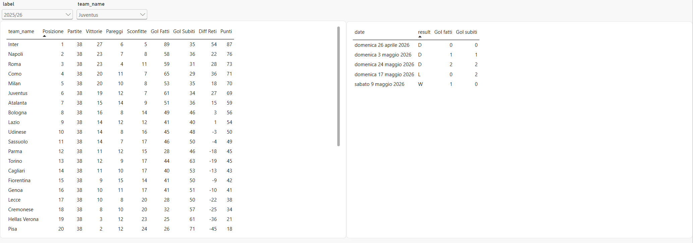
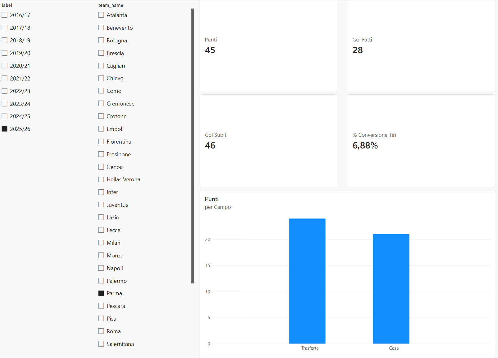
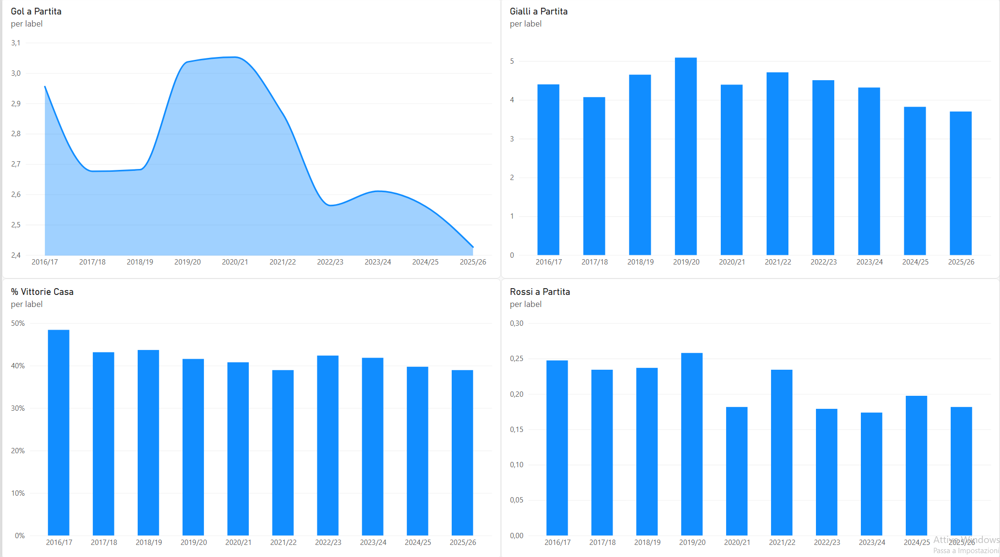
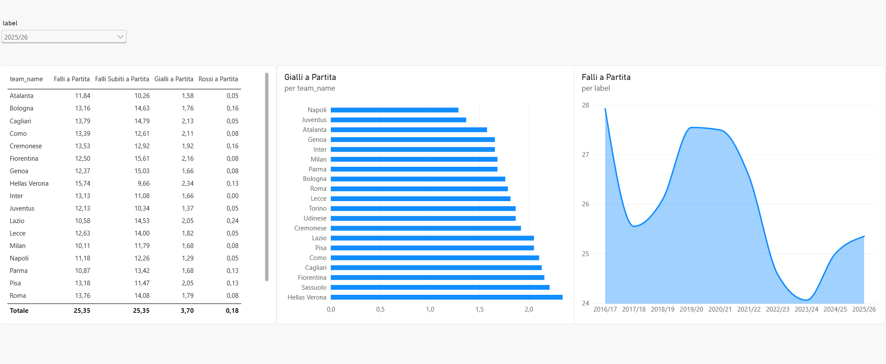

# Serie A BI

Data warehouse e dashboard sui risultati della **Serie A dal 2016/17 al 2025/26**: dalla fonte dati a una dashboard Power BI, passando da un ETL in Python e da un modello dimensionale (star schema) su MySQL.

Progetto da portfolio di **Mattia Billong**, studente ITS Business Intelligence Software Developer.



## Cosa fa
- Scarica i risultati di 10 stagioni (3.800 partite) e li **pulisce e trasforma** in uno star schema.
- Li carica in **MySQL** (Docker) in modo **ripetibile**: l'ETL si può rilanciare senza duplicare i dati.
- Controlla la **qualità dei dati** (380 partite e 20 squadre per stagione, punti dei campioni riconciliati con le classifiche ufficiali).
- Li mostra in una **dashboard Power BI** a 4 pagine: classifica, squadra, confronti tra stagioni, disciplina.

## Architettura
```
CSV (DataHub)  →  profiling  →  ETL Python (pandas)  →  MySQL 8.4 (Docker)  →  Power BI Desktop
                                 extract · transform · load   staging + star schema   modello + DAX + dashboard
```

## Modello dati
Star schema con una tabella dei fatti e quattro dimensioni:

```
dim_season ─┐
dim_date ───┼─ dim_match ── fact_team_match ── dim_team
            │    (1 riga per partita)  (1 riga per squadra per partita)
```

| Tabella | Contenuto |
|---|---|
| `fact_team_match` | **Una riga per squadra per partita** (due righe a partita): gol, tiri, falli, corner, cartellini, esito, punti |
| `dim_match` | Una riga per partita: giornata, squadre, data, stagione |
| `dim_team`, `dim_season` | Squadre e stagioni |
| `dim_date` | Calendario continuo (3.565 giorni) |
| `stg_matches` | Area di staging: i CSV grezzi, per tracciabilità |

Dettagli, tipi e regole di additività in [`docs/data_dictionary.md`](docs/data_dictionary.md).

## Dashboard
| Classifica | Squadra |
|---|---|
|  |  |
| **Confronti tra stagioni** | **Disciplina e gioco duro** |
|  |  |

Le 17 misure DAX sono documentate in [`docs/dax/misure.md`](docs/dax/misure.md). Osservazioni sui dati in [`docs/insights.md`](docs/insights.md).

## Come eseguirlo
**Requisiti:** Python 3.12 o successivo, Docker Desktop, e (solo per la dashboard) Windows con Power BI Desktop e il driver *MySQL Connector/NET*.

```powershell
git clone https://github.com/billongmattia/serie-a-bi.git
cd serie-a-bi
python -m venv .venv
.\.venv\Scripts\Activate.ps1
pip install -r requirements.txt
docker compose up -d --wait      # avvia MySQL sulla porta 3308
python -m etl.run_etl            # scarica, trasforma, carica e controlla i dati
python -m pytest                 # test automatici
```

L'ETL scrive un riepilogo e il log in `logs/etl.log`. Si può rilanciare quando si vuole.

**Aprire la dashboard:** apri `powerbi/dashboard.pbix`. Se Power BI chiede le credenziali del database: server `localhost:3308`, database `serie_a`, utente `serie_a`, password `serie_a_pw` (valori di sviluppo del database locale in Docker), tipo "Database". Poi **Home → Aggiorna**.

**Cambiare i parametri del database** (porta, utente, password): le variabili sono elencate in [`.env.example`](.env.example). Un file `.env` è letto **solo da Docker Compose**; l'ETL Python legge le **variabili d'ambiente** della shell, quindi vanno impostate anche lì (per esempio `$env:MYSQL_PORT = "3310"` in PowerShell prima di lanciare `python -m etl.run_etl`). Senza modifiche, entrambi usano i valori predefiniti.

## Struttura del repository
```
├── docker-compose.yml        MySQL in Docker
├── requirements.txt
├── sql/                      schema (staging, star schema) e controlli di qualità
├── etl/                      extract, transform, load, qualità, run_etl
├── tests/                    test automatici (pytest)
├── powerbi/                  dashboard.pbix e screenshot
└── docs/                     dizionario dati, misure DAX, insight, milestone, spiegazioni
```

## Qualità e test
- **29 test** automatici sulle fasi dell'ETL (download con cache, profiling, trasformazione, caricamento idempotente, controlli di qualità, gestione degli errori).
- Controlli SQL dopo ogni caricamento: ogni stagione è un **girone completo** (partite = squadre × (squadre − 1): 380 con 20 squadre), due righe di fatto per partita, punti e gol coerenti, **riconciliazione** con i punti ufficiali dei campioni (Juventus 2016/17: 91; Inter 2023/24: 94).
- Gli errori non previsti dell'ETL finiscono in `logs/etl.log` e il programma esce con codice 1.

## Fonte dei dati
Dataset [**Italian Serie A** di DataHub](https://datahub.io/football/italian-serie-a), a sua volta derivato da [football-data.co.uk](https://www.football-data.co.uk/). Licenza [Open Data Commons Public Domain Dedication and License (PDDL)](https://opendatacommons.org/licenses/pddl/).

## Limiti noti
- La colonna **arbitro** è sempre vuota nella fonte per la Serie A: non è presente nel modello.
- La **giornata** è ricostruita (il CSV non la contiene) come il numero progressivo di partita delle squadre in stagione: i recuperi possono falsarla leggermente.
- Una partita (Sassuolo–Pescara, 28/08/2016) non ha i gol del primo tempo nella fonte: restano `NULL`.
- Il periodo è fissato a 10 stagioni complete (2016/17–2025/26): cambiare `FIRST_SEASON` in `etl/config.py` per estenderlo. Le stagioni più vecchie avranno più valori `NULL` (non provato) e una **stagione in corso fallirebbe** il controllo del girone completo.

## Documentazione e percorso di lavoro
- Spiegazioni passo per passo in [`docs/spiegazioni/`](docs/spiegazioni/).
- Milestone e task in [`docs/milestones/`](docs/milestones/).
- Specifica e piano di implementazione in [`docs/superpowers/`](docs/superpowers/).

## Prossimi passi
- Frontend **Streamlit** sugli stessi dati.
- Conversione della dashboard in formato `.pbip` (testuale, più adatto a Git).
- CI con GitHub Actions per eseguire i test a ogni push.
